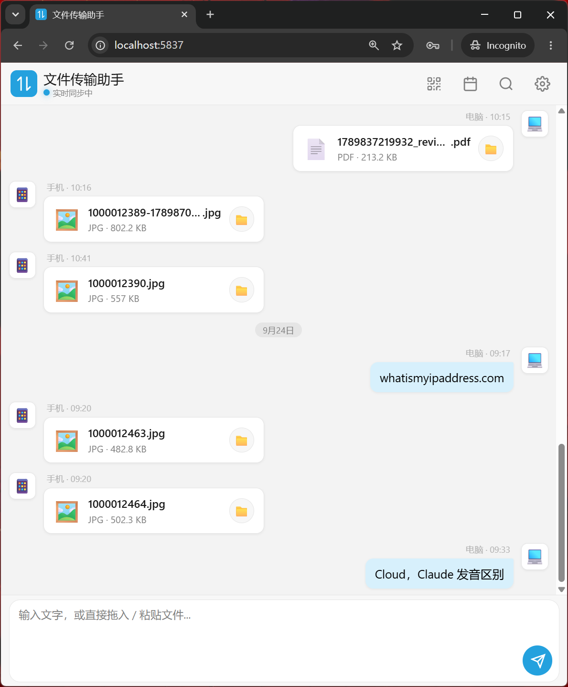

<p align="center">
  
</p>

<h1 align="center">LinkFlow</h1>

<p align="center"><strong>专为「手机 ↔ 电脑」打造的极简私人内容传输工具。</strong></p>

<p align="center">
  <a href="LICENSE"></a>
</p>

LinkFlow 像微信“文件传输助手”一样随手丢文字、截图、照片、视频、PDF、ZIP，但不依赖微信/QQ，零外部云端，局域网极速直连，手机免装 App 扫码即用。当前版本为 **v0.3.0**（Windows 原生实现）。

<p align="center">
  
</p>

## 亮点特性 (Features)

- **双向内容时间线**：手机与电脑双向即时呈现，清晰的时间戳与设备来源标识。
- **手机免装 App**：电脑启动服务，手机扫码即可在浏览器打开；配对二维码携带随机令牌，支持 PWA「添加到主屏幕」。
- **全格式多媒体支持**：
  - 📝 **文字**：一键复制，手机端发送文字可选**自动同步至 Windows 剪贴板**。
  - 🖼️ **图片与各类文件**：图片作为标准文件无损直发，不生成任何缩略图，以极简文件卡片统一呈现，支持一键下载与本地资源管理器定位。
  - 📄 **任意文件**：PDF、视频、音频、ZIP、Word、代码文件等统一展示；单文件上传上限为 256 MB。
- **快捷交互**：
  - 💻 **截图即发**：在窗口中直接按 `Ctrl + V`，剪贴板中的截图秒速上传。
  - 📂 **拖拽上传**：将任何文件直接拖入浏览器窗口即可投放。
  - 📷 **手机直拍**：手机端点击相机图标直接调用后置/前置摄像头拍照上传。
  - 🔍 **即时搜索**：按回车或输入关键字实时过滤历史记录。
  - 🌓 **深色/浅色模式**：自由切换，夜间使用更舒适。
  - 📌 **系统托盘常驻**：后台常驻任务栏托盘，左键/双击即刻打开主界面；右键菜单支持一键复制手机连接地址、打开文件目录与优雅退出。
- **本地优先与局域网保护**：
  - HTTP、WebSocket 和文件下载均校验配对令牌，跨站请求会被拒绝。
  - 剪贴板、设置和资源管理器操作只能从 Windows 主机调用。
  - 数据保存在本地 `data/messages.db` 和 `data/files/YYYY-MM/`；配对令牌保存在 `data/config.json`。

## 技术栈 (Tech Stack)

- **C# / .NET 10**，WinForms 窗口外壳 + 系统托盘（原生右键菜单，按显示器真实 DPI 渲染）。
- **WebView2** 承载界面：`static/` 下的网页由手机端和电脑端共用。
- **ASP.NET Core Kestrel** 提供局域网 HTTP / WebSocket 服务；**SQLite** 保存消息记录。

旧版 Python/PyQt 实现保留在 [v0.2.2](../../releases/tag/v0.2.2)。

## 快速上手 (Quick Start)

需要 Windows 10/11、[.NET 10 SDK](https://dotnet.microsoft.com/download) 和 WebView2 运行时（Windows 11 已自带）。

在项目目录用 PowerShell 7 运行：

```powershell
pwsh -File .\build.ps1
```

脚本会编译到 `dist\`，在桌面创建 **LinkFlow** 快捷方式并启动；之后直接点桌面图标即可。

- **退出**：右键托盘图标选择「退出」，或运行 `dist\LinkFlow.exe --stop`。
- **查看日志**：右键托盘图标选择「查看运行日志」；日志保存在 `data/linkflow.log`，会自动轮转。
- **防火墙**：首次启动时如 Windows 防火墙询问，需允许 LinkFlow 访问专用网络，手机才能连接。

### 手机端连接：
1. 确保手机与电脑连接到同一个 Wi-Fi。
2. 在电脑界面点击右上角 **「扫码连接」**。
3. 使用手机相机或浏览器扫描带配对令牌的二维码，即可开始双向传输。

首次配对后，令牌会保存在手机浏览器的本地存储中。服务重启后令牌保持不变；如需重新配对，可删除 `data/config.json` 后重启 LinkFlow。

版本更新记录见 [CHANGELOG.md](CHANGELOG.md)。

## 开源协议 (License)

本项目采用 [MIT 许可证](LICENSE)。
